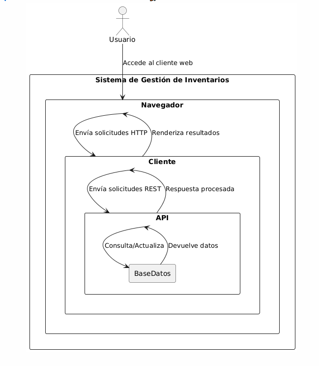

# Documentación del Proyecto


## 1. Descripción del Proyecto
Partiendo de las necesidades de un cliente real relacionadas con la gestión de invernaderos, se plantearon una serie de preguntas clave para determinar los requerimientos específicos del sistema. Estas preguntas incluyen:

- ¿Qué tipo de productos necesitas gestionar en tu inventario? (Semillas, fertilizantes, herramientas, etc.)
- ¿Cuánta información necesitas almacenar sobre cada producto? (Nombre, precio, cantidad, categoría, fecha de adquisición, etc.)
- ¿Es necesario clasificar los productos por categorías o ubicaciones dentro del invernadero?
- ¿Qué funcionalidades son esenciales para el sistema? (Agregar, editar, eliminar, buscar productos, etc.)
- ¿Cuántos usuarios van a acceder al sistema? ¿Será de uso exclusivo local o en red?
- ¿Necesitas generar informes o currículum?
- ¿Es importante incluir una funcionalidad de paginación para manejar grandes volúmenes de datos?

Con base en estas necesidades, se diseñó e implementó este proyecto: una aplicación web para la gestión de inventarios. La aplicación permite realizar operaciones CRUD (“Crear, Leer, Actualizar y Eliminar”) sobre una base de datos SQLite que almacena información sobre productos. Está diseñado para ejecutarse localmente, ofreciendo una API RESTful y una interfaz web interactiva desarrollada en Go.

### Características principales:
- Listado de productos con soporte para paginación.
- Agregado de nuevos productos.
- Eliminación de productos existentes.
- Persistencia de datos mediante SQLite.

---

## 2. Arquitectura del Proyecto

### 2.1 Componentes principales
- **API RESTful**: Gestiona las operaciones CRUD sobre la base de datos SQLite.
- **Cliente web**: Una interfaz desarrollada con plantillas HTML y CSS que permite interactuar con la API.
- **Base de datos**: SQLite se utiliza como sistema de almacenamiento persistente.

### 2.2 Tecnologías utilizadas
- **Lenguaje**: Go (Golang).
- **Base de datos**: SQLite.
- **Gestor de dependencias**: Módulos de Go.
- **Frontend**: HTML, CSS.

### 2.3 Diagrama de funcionamiento

1. El usuario accede al cliente web desde su navegador.
2. El cliente envía solicitudes HTTP a la API RESTful para listar, agregar o eliminar productos.
3. La API interactúa con la base de datos SQLite para realizar las operaciones solicitadas.
4. El cliente web muestra los resultados de las operaciones.

---

## 3. Casos de Prueba

### 3.1 Pruebas funcionales
#### **Caso 1: Listar productos con paginación**
**Descripción**: Verificar que la lista de productos se muestre correctamente, respetando los límites de la paginación.
- **Entrada**: Parámetro de URL `page` con un número de página válido.
- **Proceso**: El cliente web realiza una solicitud GET a la API con el parámetro `page`.
- **Salida esperada**: Una lista de productos correspondiente a la página solicitada.

#### **Caso 2: Agregar un producto**
**Descripción**: Comprobar que un producto nuevo se agrega correctamente.
- **Entrada**: Nombre, precio, cantidad y categoría del producto.
- **Proceso**: El cliente web envía una solicitud POST a la API.
- **Salida esperada**: El producto aparece en la lista de productos.

#### **Caso 3: Eliminar un producto**
**Descripción**: Verificar que un producto existente se elimina correctamente.
- **Entrada**: ID del producto a eliminar.
- **Proceso**: El cliente web envía una solicitud POST al endpoint de eliminación.
- **Salida esperada**: El producto desaparece de la lista.

### 3.2 Pruebas de integración
- Verificar que el cliente web y la API RESTful se comuniquen correctamente.
- Probar la persistencia de datos tras reiniciar la aplicación.

---

## 4. Instrucciones para Compilar, Ejecutar e Implementar

### 4.1 Requisitos previos
- Go instalado (versión 1.18 o superior).
- SQLite instalado (opcional, para inspeccionar la base de datos).
- Tener preinstalado "gcc" de 64 bits.

### 4.2 Instrucciones para compilar
1. Navega al directorio del proyecto:
   ```bash
   cd /ruta/del/proyecto
   ```
### 4.3 Instrucciones para ejecutar
1. Ejecuta el archivo compilado:
   ```bash
   go run main.go
   ```
2. Abre tu navegador y accede a:
   ```
   http://localhost:8081
   ```

### 4.4 Instrucciones para implementar
Para implementar el proyecto en un servidor:
1. Sube los archivos del proyecto al servidor.
2. Configura un servicio systemd o equivalente para mantener el proceso en ejecución.
3. Asegúrate de que los puertos 8080 (API) y 8081 (cliente) estén abiertos.

---

## 5. Informe Detallado

### 5.1 Descripción técnica
#### **API RESTful**
- **Endpoints principales**:
  - `GET /`: Lista los productos con paginación (requiere el parámetro `page`).
  - `POST /add`: Agrega un nuevo producto.
  - `POST /delete`: Elimina un producto por ID.

#### **Cliente Web**
- Interfaz construida con plantillas HTML renderizadas por el paquete `html/template` de Go.
- Soporte para paginación y renderización de datos dinámica.
- Interacciones mediante formularios HTTP.

#### **Base de datos**
- SQLite se utiliza como sistema de almacenamiento persistente.
- La tabla `products` tiene las siguientes columnas:
  - `id`: Identificador único.
  - `name`: Nombre del producto.
  - `price`: Precio del producto.
  - `quantity`: Cantidad disponible.
  - `category`: Categoría del producto.

### 5.2 Mejoras futuras
- Agregar autenticación y autorización para proteger la API.
- Agregar notificaciones con MQTT
- Mejorar el diseño de la interfaz web con librerías como Bootstrap.

# 6. Temas del curso

### 6.1 Temas del curso que han sido abordados
- RESTful Web Services.
- Bases de datos.
- Templates en Go.
- Manejo de solicitudes.
- Paginación y gestión de grandes volúmenes de datos.
- Programación de red en Go.
- Programación web en Go.
- Arquitectura de sistemas distribuidos.

